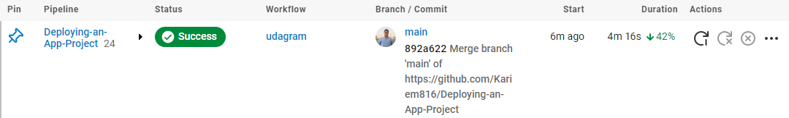
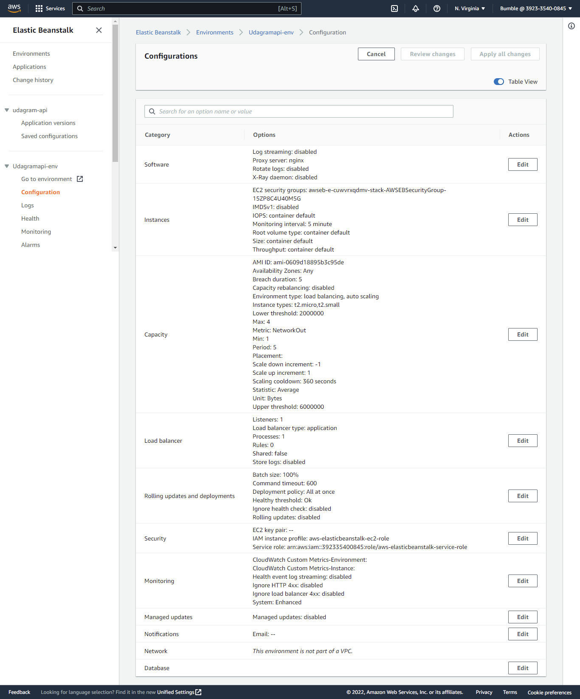

# Infrastructure Description


The infrastructure of this project is composed of three parts:
- A static website hosted on S3
- A backend RESTful API hosted on Elastic Beanstalk
- A database hosted on RDS.

The application is deployed automatically using a CI/CD pipeline. The pipeline is run using CircleCI.


---
## AWS Services

### Static Website
The static website is hosted on S3. The website is a single page application that uses the backend API to get data.

- S3 Bucket: `static-app-project-3`
- S3 Bucket Policy:
```json
{
    "Version": "2012-10-17",
    "Statement": [
        {
            "Sid": "PublicReadGetObject",
            "Effect": "Allow",
            "Principal": "*",
            "Action": [
                "s3:GetObject",
                "s3:GetObjectAcl",
                "s3:PutObject",
                "s3:PutObjectAcl"
            ],
            "Resource": "arn:aws:s3:::static-app-project-3/*"
        }
    ]
}
```
- S3 Configuration:


### Backend API
The backend API is hosted on Elastic Beanstalk.

- Elastic Beanstalk Application: `udagram-api`
- Elastic Beanstalk Environment: `Udagramapi-env`
- Backend API URL: `http://udagramapi-env.eba-uk6pbbjf.us-east-1.elasticbeanstalk.com/`
- Elastic Beanstalk Configuration:



### Database
The database is hosted on RDS.

- RDS Configuration:


### Images Storage
The app allows users to post images and write things about them. The images are stored on S3.

- S3 Bucket: `file-storage-project-3`
- S3 Bucket Policy:
```json
{
    "Version": "2012-10-17",
    "Statement": [
        {
            "Sid": "PublicReadGetObject",
            "Effect": "Allow",
            "Principal": "*",
            "Action": [
                "s3:GetObject",
                "s3:GetObjectAcl",
                "s3:PutObject",
                "s3:PutObjectAcl"
            ],
            "Resource": "arn:aws:s3:::file-storage-project-3/*"
        }
    ]
}
```
- S3 Configuration:

