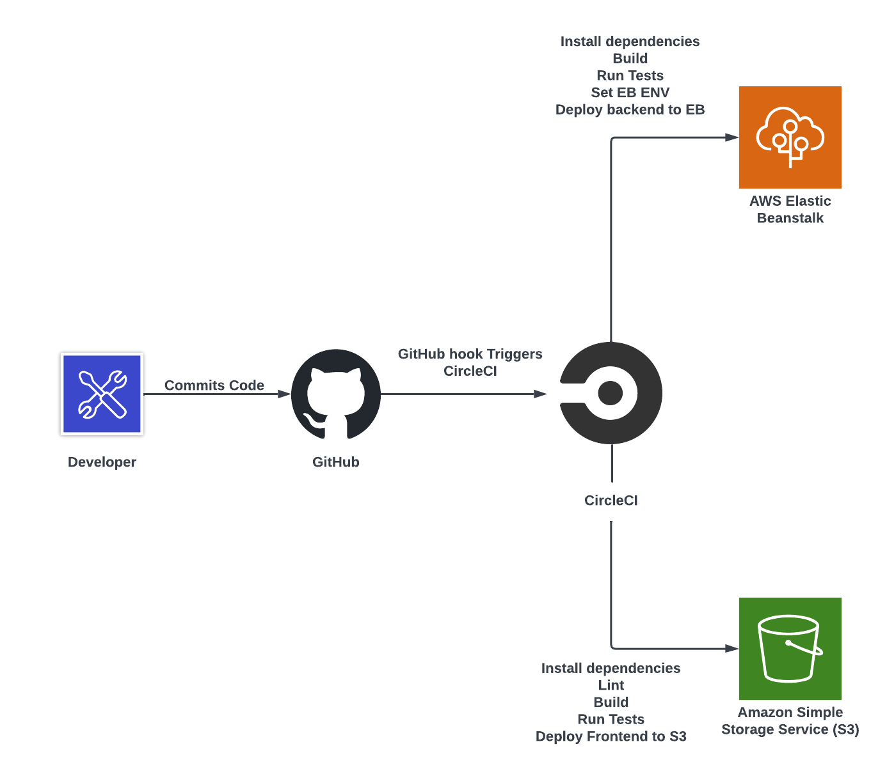
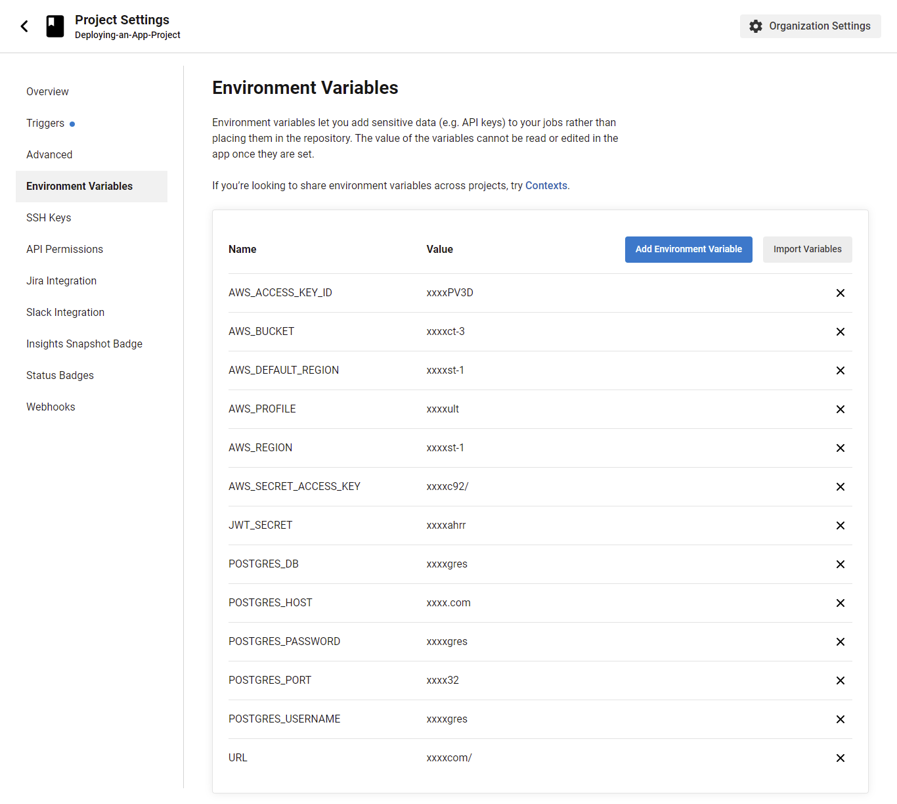

# Pipeline Process

This document describes the pipeline process used to deploy the application.
**Pipeline Diagram**

## Pipeline

The pipeline is run using CircleCI.

**CircleCI Configuration**

> You can see the pipeline [here](../.circleci/config.yml).

### Workflow

### Jobs

Workflow jobs are described below:

- **build**: This job builds the both the frontend and the backend.

- **hold**: This job holds the pipeline until the deployment is approved manually.

- **deploy**: This job deploys the application to AWS.

